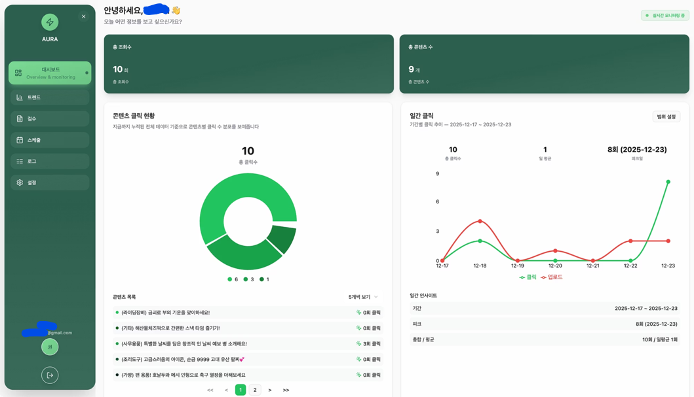
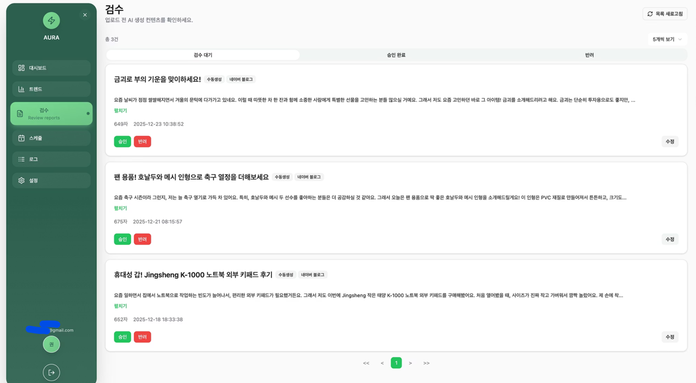
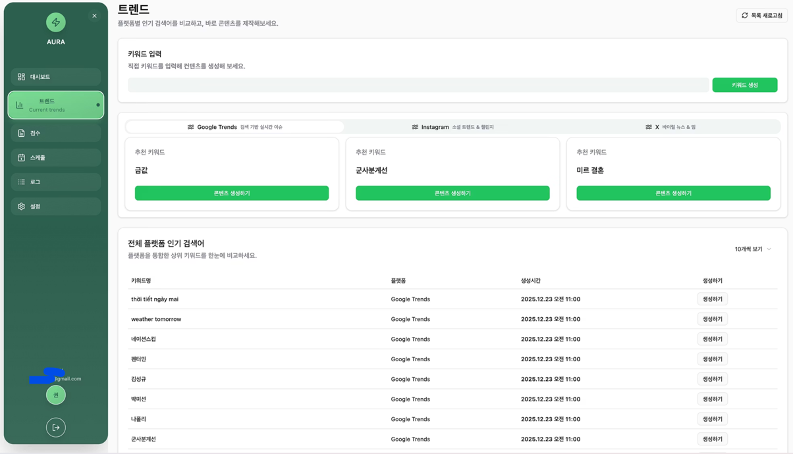
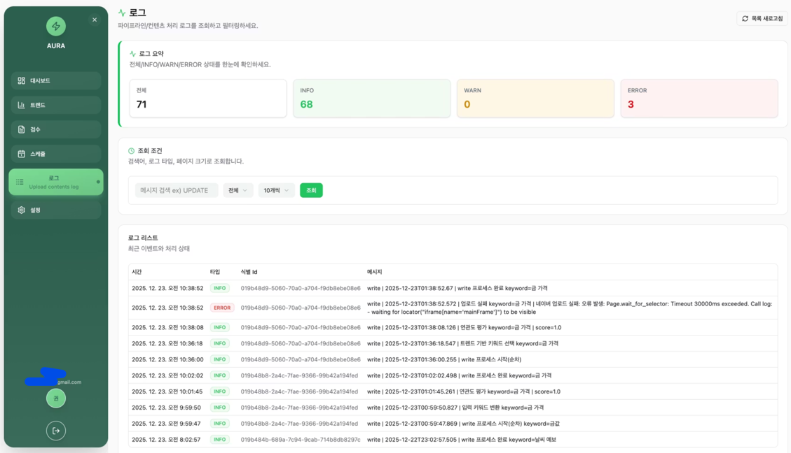
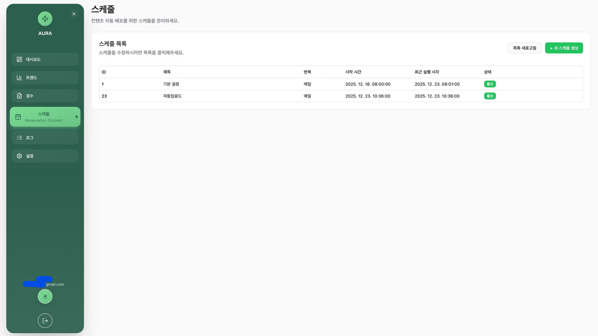
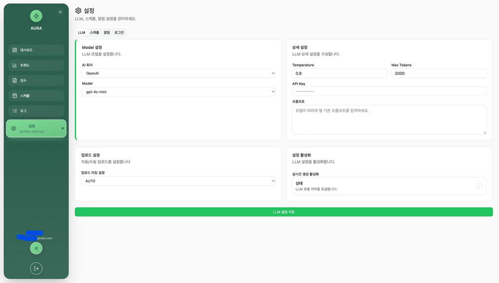
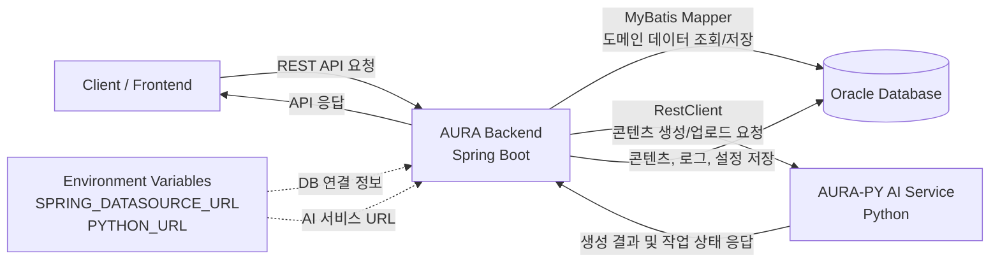

# AURA Backend

AI 기반 상품 홍보 블로그 자동 생성 서비스 AURA의 백엔드 API 서버입니다.

## 프로젝트 소개

AURA는 상품 정보와 트렌드 키워드를 기반으로 홍보용 블로그 콘텐츠를 자동 생성하고, 생성된 콘텐츠의 수정, 예약 발행, 업로드 채널 설정, 운영 로그 추적, 대시보드 모니터링을 제공하는 AI 콘텐츠 운영 플랫폼입니다.

본 저장소는 Spring Boot 기반 백엔드 애플리케이션과 운영 환경 배포를 위한 Docker, AWS 인프라, CI/CD 구성을 포함합니다.

프론트엔드 페이지는 React 기반 레포지토리인 [AURA-FE](https://github.com/minwoojoo/Final-FE-fork)와 연동되어 동작합니다.

AI 콘텐츠 생성 기능은 별도 AI 서비스 레포지토리인 [AURA-PY](https://github.com/minwoojoo/AURA-PY)와 연동되어 동작합니다.

<br>

## 서비스 화면

### 전체 시연

AURA의 주요 흐름을 한눈에 확인할 수 있는 전체 서비스 시연 화면입니다.


### 대시보드화면

콘텐츠 운영 현황, 상태별 통계, 클릭 수와 생성 추이를 한눈에 확인할 수 있는 운영 대시보드입니다.



### 검수화면

AI가 생성한 콘텐츠를 검토하고 필요한 내용을 수정한 뒤 발행 또는 예약 단계로 넘길 수 있는 검수 화면입니다.



### 트렌드화면

트렌드 키워드를 확인하고 키워드 기반 콘텐츠 생성을 요청할 수 있는 트렌드 관리 화면입니다.



### 로그화면

애플리케이션 로그와 파이프라인 처리 내역을 확인해 콘텐츠 생성 및 운영 상태를 추적할 수 있는 로그 화면입니다.



### 스케줄설정화면

콘텐츠 예약 발행 시간과 활성화 여부를 설정해 자동 업로드 흐름을 관리하는 스케줄 설정 화면입니다.



### 설정화면

LLM 채널, 업로드 채널, 알림 Credential 등 서비스 운영에 필요한 설정을 조회하고 수정하는 설정 화면입니다.



<br>

## 핵심 기여 요약

- LLM 채널 및 설정 관리 도메인 설계
- 설정 조회/수정 REST API 구현 및 예외 처리
- 프론트엔드와 백엔드 간 프로덕션 API 연동
- CORS 및 API Endpoint 불일치 문제 해결
- Spring Boot 백엔드 컨테이너 실행 환경 구성
- AWS CDK 기반 IaC 구조 설계
- AWS ECR/ECS 기반 무중단 배포 파이프라인 구축
- ECS Circuit Breaker, CloudWatch 기반 장애 대응 및 모니터링 구성

<br>

## 개인 담당 및 기여 내용

핵심 백엔드 및 인프라/DevOps 엔지니어로 참여했습니다.

LLM 설정 관리, 콘텐츠 생성 흐름과 연동되는 백엔드 API, 운영 환경 배포 구조, AWS 기반 인프라 자동화, CI/CD 파이프라인, 프로덕션 API 연동 안정화 등 서비스 운영에 필요한 백엔드와 배포 영역 전반을 담당했습니다.

<br>

## 역할 및 핵심 구현 성과

### 동적 LLM 설정 구조 설계

AI 모델 설정을 코드에 고정하지 않고 사용자 또는 운영자가 직접 조회하고 수정할 수 있도록 LLM 설정 관리 도메인을 구축했습니다.

- `LlmChannel` Entity, DTO, Mapper, Service, Controller 구조 설계
- 사용자별 LLM 설정 조회 API 구현
- 멱등성 있는 설정 수정을 위해 `PUT` 기반 수정 API로 정리
- 설정 미존재, 중복 설정, 필수 API Key 누락 등에 대한 비즈니스 예외 처리
- 회원가입 시 기본 LLM 채널이 안전하게 바인딩되도록 검증 로직 구현

### 데이터 모델 리팩토링

초기 모델 구조에서 실제 서비스 흐름과 맞지 않는 속성을 제거하고, 콘텐츠 생성 방식 확장을 위한 구조를 추가했습니다.

- 불필요하거나 중복되는 `base_url`, `top_p` 속성 제거
- 다양한 생성 패러다임을 지원하기 위해 `generation_type` 속성 추가
- Flyway 마이그레이션으로 DB 변경 이력 관리
- 도메인 모델, DTO, Mapper 요청/응답 구조 동기화

### 프로덕션 API 연동 및 CORS 문제 해결

로컬 개발 환경에서 AWS 프로덕션 환경으로 이관하는 과정에서 발생한 프론트엔드-백엔드 통신 문제를 진단하고 해결했습니다.

- 환경별 API Base URL 차이 분석
- CORS 허용 도메인 및 API Endpoint 연결 체계 정리
- 잘못된 Endpoint 접근으로 발생하던 무한 API 호출 상황 방지
- 프로덕션 환경에서 안정적인 API 통신 흐름 확보

### Docker 및 AWS CDK 기반 인프라 구성

운영 환경의 실행 일관성, 재현성, 보안성을 높이기 위해 컨테이너 기반 실행 구조와 코드 기반 인프라를 구성했습니다.

- Spring Boot 백엔드 전용 Docker 실행 환경 구성
- AWS CDK를 활용한 인프라 코드화
- VPC 기반 네트워크 격리 구조 설계
- AWS Secrets Manager를 통한 API Key, DB 접속 정보 등 민감 정보 관리
- 수동 콘솔 설정 의존도를 낮추고 배포 재현성 개선

### GitOps 기반 CI/CD 및 운영 안정화

PR 머지 이후 테스트, 이미지 빌드, ECR Push, ECS 롤링 배포가 자동으로 이어지는 배포 흐름을 구성했습니다.

- main 브랜치 Pull Request 머지 트리거 기반 자동 배포
- AWS ECR 이미지 빌드 및 Push 자동화
- AWS ECS 서비스 롤링 배포 구성
- ECS Circuit Breaker 기반 자동 롤백 체계 도입
- CloudWatch 모니터링 및 알람 기반 장애 감지 체계 구성

<br>

## 상세 기술 기여

### 설정 관리 API 설계

LLM, 업로드 채널, 알림 Credential, 예약 발행 설정처럼 운영자가 변경할 수 있는 값을 독립된 설정 도메인으로 분리했습니다.

- 설정 조회/수정 요청과 응답 DTO를 분리해 API 계약 명확화
- 사용자별 설정 조회 흐름과 기본 설정 바인딩 검증 구현
- 설정 누락, 중복, 필수 값 누락 상황에 대한 도메인 예외 처리

### 외부 AI/Python 서버 연동

콘텐츠 생성 요청이 외부 AI/Python 서버와 안정적으로 연동되도록 백엔드 API 연결 구조를 정리했습니다.

- 상품 기반 콘텐츠 생성 요청 흐름 구현
- 트렌드 키워드 기반 콘텐츠 생성 요청 흐름 구현
- 외부 서버 URL을 환경 변수로 분리해 환경별 실행 구조 지원

### DB 마이그레이션 관리

Flyway를 사용해 스키마 변경 이력을 관리했습니다.

| Migration | 설명 |
| --- | --- |
| `V10__add_warn_logtype_add_keyword_drop_trend_fk_remove_llm_columns.sql` | 로그 타입 추가, 콘텐츠 키워드 추가, LLM 불필요 컬럼 제거 |
| `V11__add_generation_type_to_llm_channel.sql` | LLM 채널 생성 타입 컬럼 추가 |
| `V12__insert_product_category.sql` | 상품 카테고리 초기 데이터 추가 |

<br>

## 기술적 문제 해결 및 최적화

### 프로덕션 API 연결 문제 해결

AWS 프로덕션 환경 이관 과정에서 프론트엔드와 백엔드 간 API Base URL, CORS 허용 도메인, Endpoint 경로가 일치하지 않아 API 호출이 실패하거나 반복 호출되는 문제를 확인했습니다.

환경별 API 연결 값을 재정리하고 CORS 정책과 Endpoint 사용 방식을 맞춰 프로덕션 환경에서도 안정적으로 API 통신이 가능하도록 개선했습니다.

### 배포 환경 변수 유실 문제 해결

AWS 콘솔에서 수동으로 설정했던 컨테이너 환경 변수가 자동 배포 과정에서 초기화되는 문제를 해결했습니다.

- 수동 콘솔 설정의 재현성 한계 분석
- 배포 스크립트 및 인프라 설정 레이어에서 필수 환경 변수 명시 주입
- DB 연결 정보, API URL, Secret 값이 배포 이후에도 안정적으로 유지되도록 개선

### 운영 안정성 개선

- ECS Rolling Deployment로 무중단 배포 흐름 구성
- ECS Circuit Breaker로 배포 실패 시 자동 롤백
- CloudWatch로 로그 및 인프라 상태 모니터링
- Secrets Manager로 민감 정보 암호화 관리
- 배포 스크립트 레이어에서 필수 환경 변수 명시 주입

<br>

## 프로젝트 주요 기능

### 회원 및 인증

- 회원가입
- 로그인 및 로그아웃
- JWT 기반 인증
- 내 정보 조회
- 회원 정보 수정
- 비밀번호 변경

### AI 콘텐츠 관리

- 상품 기반 콘텐츠 생성 요청
- 트렌드 키워드 기반 콘텐츠 생성 요청
- 콘텐츠 목록 및 상세 조회
- 콘텐츠 수정
- 콘텐츠 상태 변경
- 콘텐츠 외부 링크 업데이트

### 상품 및 트렌드 관리

- 상품 등록, 조회, 카테고리 관리
- 상품 정보와 콘텐츠 생성 흐름 연동
- 트렌드 키워드 등록 및 조회
- 외부 AI/Python 서버 연동

### 설정 관리

- LLM 채널 설정 조회 및 수정
- 업로드 채널 설정 조회 및 수정
- 업로드 채널 활성화 상태 변경
- 알림 Credential 설정 조회 및 수정
- 예약 발행 설정 조회 및 수정

### 예약 발행

- 예약 생성, 조회, 수정, 삭제
- 예약 활성화 상태 변경
- 콘텐츠 발행 스케줄 관리

### 로그 및 대시보드

- 애플리케이션 로그 저장 및 조회
- 로그 타입별 집계
- 파이프라인 로그 SSE 스트리밍
- 콘텐츠 상태 통계
- 일별 클릭 수 및 콘텐츠 개수 집계

<br>

## 기술 스택

### Backend

- Java 21
- Spring Boot 3.5.7
- Spring MVC
- Spring Security
- Spring Validation
- Spring AOP
- Spring Data JDBC
- MyBatis 3.0.5
- Lombok
- RestClient

### Database

- Oracle Database
- Flyway
- MyBatis XML Mapper

### DevOps & Infra

- Docker
- Docker Compose
- AWS CDK
- AWS ECR
- AWS ECS
- AWS Secrets Manager
- Amazon CloudWatch
- GitHub Actions

### Documentation & Test

- Swagger UI
- OpenAPI 3
- Springdoc OpenAPI
- JUnit 5
- Spring Boot Test
- Spring Security Test

<br>

## 프로젝트 구조

```text
Final-BE/
├── src/
│   ├── main/
│   │   ├── java/com/final_team4/finalbe/
│   │   │   ├── _core/              # 공통 설정, 예외 처리, JWT, Security, Swagger, Scheduler
│   │   │   ├── auth/               # 로그인 및 토큰 응답
│   │   │   ├── user/               # 회원가입, 사용자 정보, 비밀번호 변경
│   │   │   ├── product/            # 상품 및 상품 카테고리
│   │   │   ├── content/            # AI 생성 콘텐츠 관리
│   │   │   ├── trend/              # 트렌드 키워드 및 콘텐츠 생성 요청
│   │   │   ├── schedule/           # 예약 발행 및 예약 설정
│   │   │   ├── setting/            # LLM, 업로드 채널, 알림 설정
│   │   │   ├── notification/       # 알림 및 Slack 연동
│   │   │   ├── logger/             # 애플리케이션/파이프라인 로그
│   │   │   ├── dashboard/          # 운영 대시보드 통계
│   │   │   ├── link/               # 외부 접근 링크 처리
│   │   │   ├── restClient/         # 외부 AI/Python 서버 연동
│   │   │   └── FinalBeApplication.java
│   │   └── resources/
│   │       ├── db/migration/       # Flyway 마이그레이션
│   │       ├── mapper/             # MyBatis XML Mapper
│   │       └── application.yml     # 애플리케이션 설정
│   └── test/
│       └── java/com/final_team4/finalbe/
├── .github/workflows/              # GitHub Actions 워크플로우
├── build.gradle                    # Gradle 빌드 설정
├── docker-compose.yml              # Docker Compose 설정
├── .env.example                    # 환경 변수 예시
└── README.md
```

<br>

## ERD

서비스의 주요 도메인과 테이블 관계를 전체 ERD로 설계했습니다.

[전체 ERD PDF 보기](docs/image/erd.pdf)

<br>

## 아키텍처

AURA 백엔드는 도메인 중심의 레이어드 아키텍처를 따릅니다.



- 백엔드는 `SPRING_DATASOURCE_URL` 기반으로 Oracle DB에 연결하고, MyBatis Mapper를 통해 주요 도메인 데이터를 조회/저장합니다.
- AI 콘텐츠 생성 및 업로드 요청은 `PYTHON_URL`로 주입된 [AURA-PY](https://github.com/minwoojoo/AURA-PY) 서비스에 `RestClient`로 전달됩니다.
- AI 서비스의 생성 결과와 작업 상태는 백엔드 API를 통해 관리되며, 콘텐츠/로그/설정 데이터는 DB에 저장됩니다.

| Layer | 역할 |
| --- | --- |
| Controller | HTTP 요청/응답 처리, 인증 사용자 정보 전달 |
| Service | 비즈니스 로직, 검증, 트랜잭션 처리 |
| Mapper | MyBatis 기반 데이터 접근 |
| Domain | 핵심 도메인 모델 |
| DTO | 요청/응답 데이터 전달 |
| Core/Config | Security, JWT, Swagger, Scheduler, 예외 처리 등 공통 인프라 |

<br>

## 주요 API

| 도메인 | Method / Path | 설명 |
| --- | --- | --- |
| Auth | `POST /api/auth/login` | 로그인 |
| User | `POST /api/user/register` | 회원가입 |
| User | `GET /api/user/me` | 내 정보 조회 |
| User | `PATCH /api/user/update` | 회원 정보 수정 |
| User | `PATCH /api/user/password` | 비밀번호 변경 |
| Content | `GET /api/content` | 콘텐츠 목록 조회 |
| Content | `GET /api/content/{id}` | 콘텐츠 상세 조회 |
| Content | `POST /api/content` | 콘텐츠 생성 |
| Content | `PUT /api/content/{id}` | 콘텐츠 수정 |
| Trend | `POST /api/trend` | 트렌드 등록 |
| Trend | `GET /api/trend` | 트렌드 목록 조회 |
| Trend | `POST /api/trend/content` | 트렌드 기반 콘텐츠 생성 요청 |
| Schedule | `GET /api/schedule` | 예약 목록 조회 |
| Schedule | `POST /api/schedule` | 예약 생성 |
| Schedule | `PUT /api/schedule/{id}` | 예약 수정 |
| Setting | `GET /api/setting/llm` | LLM 설정 조회 |
| Setting | `PUT /api/setting/llm` | LLM 설정 수정 |
| Dashboard | `GET /api/dashboard/status` | 콘텐츠 상태 통계 |
| Log | `GET /api/log` | 로그 조회 |
| Log | `GET /api/pipeline/{jobId}` | 파이프라인 로그 스트리밍 |

<br>

## 실행 방법

### 1. 환경 변수 설정

`.env.example`을 참고해 `.env` 파일을 작성합니다.

```properties
ORACLE_PASSWORD=
APP_USER=
APP_USER_PASSWORD=

SPRING_DATASOURCE_URL=
SPRING_DATASOURCE_USERNAME=
SPRING_DATASOURCE_PASSWORD=
SPRING_JPA_HIBERNATE_DDL_AUTO=
ORACLE_DATA_VOLUME=

JWT_SECRET=
PYTHON_URL=
FRONT_URL=
COOKIE_SECURE=false
LOGGING_SYSTEM_USER_ID=1
```

### 2. Docker Compose 실행

```bash
docker compose up -d
```

Oracle DB와 Spring Boot 애플리케이션을 함께 실행합니다.

### 3. Gradle 실행

```bash
./gradlew bootRun
```

### 4. 테스트 및 빌드

```bash
./gradlew test
./gradlew build
```

### 5. API 문서 확인

```text
http://localhost:8080/swagger-ui/index.html
```

<br>

## Git & 작업 플로우

### 브랜치 네이밍

| Branch | 용도 |
| --- | --- |
| `main` | 운영 배포용 |
| `dev` | 개발 통합 |
| `feat-#` | 기능 단위 |
| `refactor-#` | 리팩토링 |
| `fix-#` | 버그 수정 |
| `hotfix-#` | 긴급 수정 |

### PR 제목 예시

- `[Feat] 회원가입 API 추가`
- `[Fix] 로그인 비밀번호 검증 오류 수정`
- `[Refactor] JWT 토큰 검증 로직 분리`
- `[Chore] logback 설정 변경`
- `[Hotfix] 세션 만료 버그 수정`
- `[Merge] 진행상황 공유`

### 배포 전략

- `main` 브랜치 Pull Request 머지 시 GitHub Actions 기반 자동 배포
- PR 단위 테스트, 이미지 빌드, ECR Push, ECS 롤링 배포 흐름 구성
- 배포 실패 시 ECS Circuit Breaker 기반 자동 롤백
- 운영 환경 설정은 AWS Secrets Manager와 배포 환경 변수로 관리
